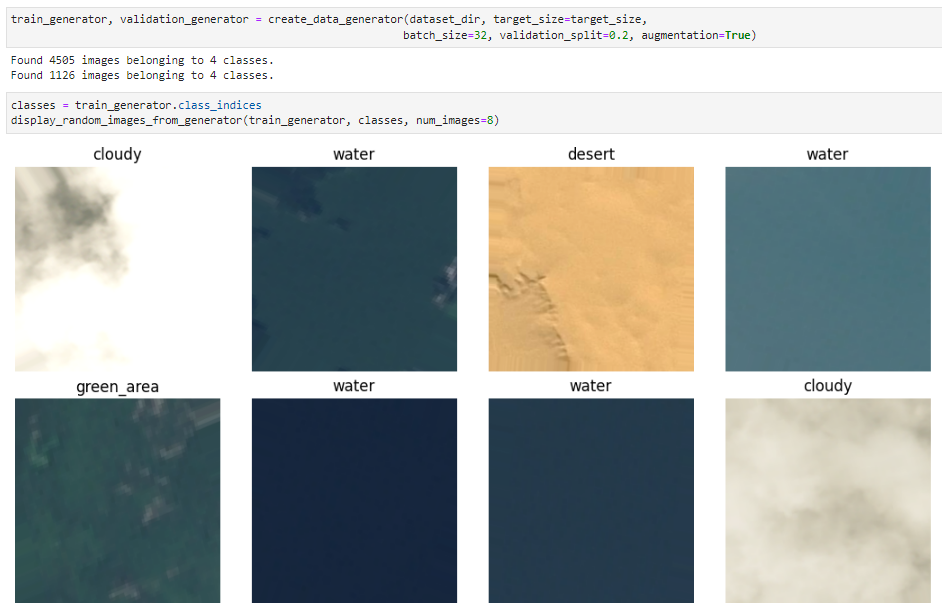
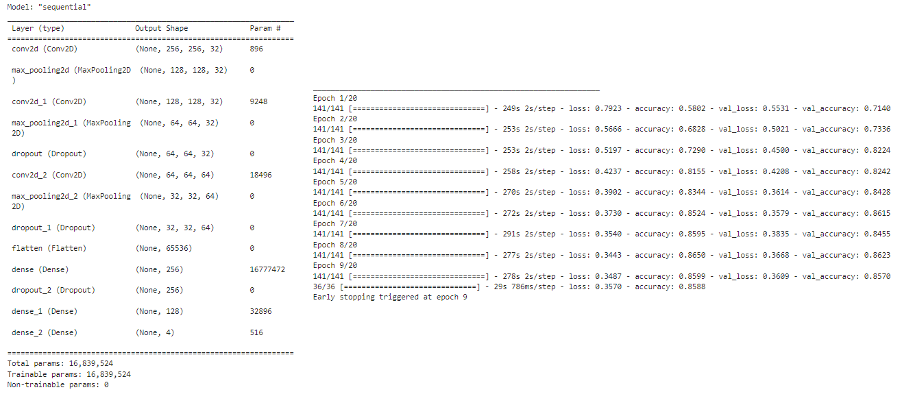
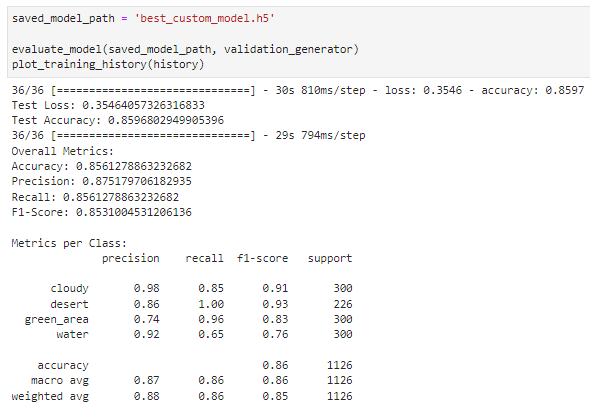
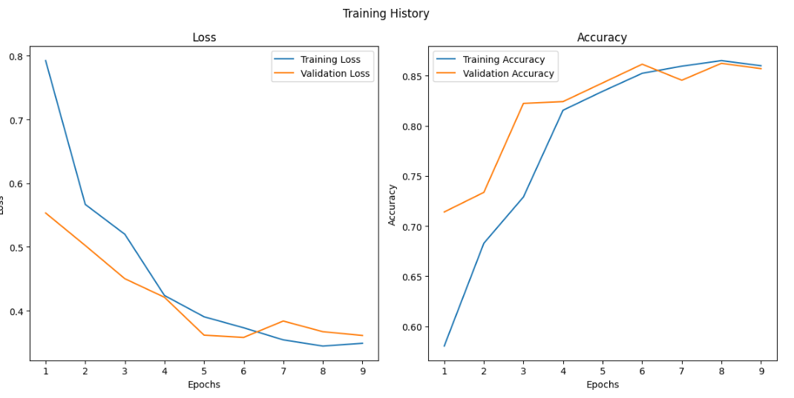
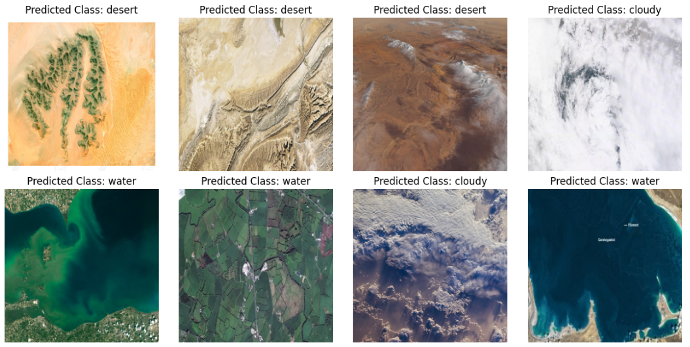
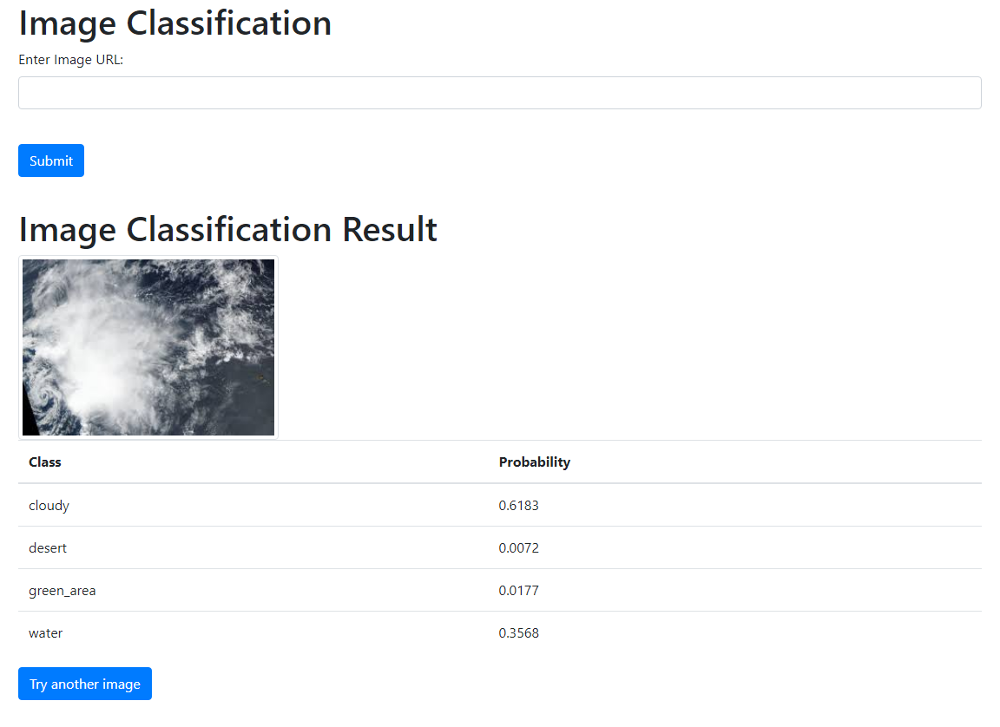

# Satellite Image Classification and Flask Web App

**Objective:** Develop a deep learning model that can classify satellite images into specific classes using a Convolutional Neural Network (CNN).

## Table of contents

- [Description](#description)
- [Data exploration and processing](#data-exploration-and-processing)
- [Image preprocessing and data generators](#image-preprocessing-and-data-generators)
- [Model building and training](#model-building-and-training)
- [Model evaluation and visualization](#model-evaluation-and-visualization)
- [Prediction on new data](#prediction-on-new-data)
- [Web Application for Image Classification](#web-application-for-image-classification)
- [Key findings and insights](#key-findings-and-insights)
- [Suggestions](#suggestions)

## Description

The data set, sourced from Kaggle's Satellite Image Classification, consists of images categorized into four classes: "cloudy," "desert," "green_area," and "water." These images vary in sizes and color channels.

## Data exploration and processing

The dataset contains a total of 5631 images, distributed among four classes:

- 'cloudy': 1500 images
- 'desert': 1131 images
- 'green_area': 1500 images
- 'water': 1500 images

The dataset includes images with three different shapes: 

- (256, 256, 4): Images with an alpha channel
- (64, 64, 3): Images without an alpha channel
- (256, 256, 3): Images without an alpha channel

## Image preprocessing and data generators

Image preprocessing is carried out using the `ImageDataGenerator` class from Keras, and images are resized to (256, 256). The data set is split into a training set with 4505 images, and a validation set with 1126 images.

## Model building and training

The model architecture consists of convolutional, pooling, dropout, and dense layers, resulting in 16,839,524 trainable parameters. Training is carried out for 9 epochs, with a batch size of 32 and a learning rate of 0.0001.

## Model evaluation and visualization

The model's accuracy on the validation set is 85.68%, with per-class precision, recall, and F1-Score metrics also provided.

## Prediction on new data

The application includes a function for classifying new images via URLs, utilizing a saved model file ('best_custom_model.h5'). 

## Web Application for Image Classification

The project includes a Flask web application that provides a user-friendly interface for image classification. It fetches the image from a provided URL, preprocesses it, passes it to the trained model for prediction, and displays the image along with the predicted class labels and their probabilities.

## Key findings and insights

- The model performs well on unseen images.
- There's potential confusion between 'green_area' and 'water' due to the color similarities in the images.
- Random testing with image URLs from the internet showed correct classification for 7 out of 8 images.

## Suggestions

- Increase the dataset size.
- Address class imbalance issues.
- Experiment with larger image sizes and additional convolutional layers.
- Consider alternative model architectures, such as using pre-trained CNNs (e.g., VGG16 or ResNet) and apply transfer learning.